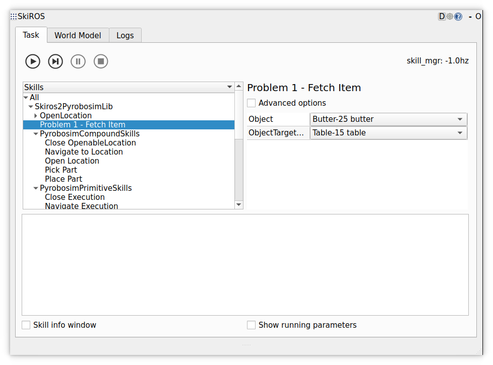

# Problem 1 - Fetch Item

In the previous markdown file [0_Start.md](0_Start.md) we learned about the primitive skills and compound skills.

The primitive skills interface directly with `pyrobosim` are in [src/skiros2_pyrobosim_lib/primitive_skills.py](../skiros2_pyrobosim_lib/primitive_skills.py).  
The compound skills that use and update the world model (WM) are in [src/skiros2_pyrobosim_lib/pyrobosim_compound_skills.py](../skiros2_pyrobosim_lib/pyrobosim_compound_skills.py).  

Now we want to use them to solve problem 1:
| Goal | Initial State | SkiROS2 Skills | Notes |
|------|---------------|------------|-------|
| Snacks on the dining room table. | Snacks in the kitchen pantry. | - Pick<br>- Navigate<br>- Place |       |

Navigate to [skiros2_pyrobosim_lib/problem_1_fetch_item.py](../skiros2_pyrobosim_lib/problem_1_fetch_item.py). You will find a skeleton for a compound skill to fill out:

```python
class problem_1(SkillBase):
    def createDescription(self):
        self.setDescription(description=Problem1(), label="Problem 1 - Fetch Item")

    def expand(self, skill):
        # We want to execute some skills in a sequence and remember which one we executed, so we use SerialStar. It will abort the skill if any of the child skills fail:
        skill.setProcessor(SerialStar())
        skill(
            # As a first step, we want to navigate to the location where the object is currently located. In our skill, this is saved in the 'ObjectStartLocation' parameter.
            # However, the 'Navigate' skill takes only a parameter 'TargetLocation', so we need to remap/rewire those parameters like this:
            self.skill("Navigate", "", remap={"TargetLocation": "ObjectStartLocation"}),
            # FIXME 1: Add more skills to solve this task
            # From here, feel free to add more skills. Check out 'pyrobosim_compound_skills.py' to see which ones are available.
        )
```

You can search the codebase for `FIXME 1` for all spots where something for problem 1 needs to be done.

## Using and Updating this Skill
In order to use this skill, it needs to be in the list of skills to be loaded in `main.launch.py`. For the `problem_1` skill, this is already done.  
From the GUI you can just select the skill and run it:



After doing any changes in code, the skill needs to be loaded with the skill manager. You can either launch the whole launch file from scratch or especially in debug mode, just restart the skill manager node.


## Tips
> Read this if you're stuck or need some idea about what to do

For this problem we need to fetch `bread` from the `pantry`. The pantry is in the kitchen and fortunately specifying the pantry as the target location is sufficient. This is what we already do here:
```python
self.skill("Navigate", "", remap={"TargetLocation": "ObjectStartLocation"}),
```

We use a `SerialStar` processor to execute the skills in sequence. This means that if any of the skills fail, the whole skill will be aborted. This is useful for this problem, because if we can't navigate to the pantry, we can't fetch the bread either.

Now we need to add the skills to fetch the bread. We need to pick it up and place it on the dining room table. The `Pick` skill is already available in `pyrobosim_compound_skills.py`. The `Place` skill is also available there. Check out their descriptions to see which parameters need to be remapped.

## Next

Once you have solved this task, you can move on to the [next problem](2_Problem_2_Waste_Disposal.md).