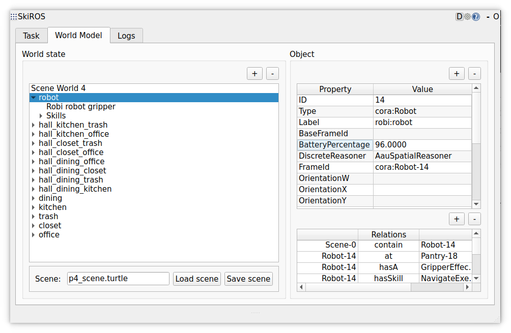

# Problem 4 - Table Setting and Waste Disposal with Limited Battery
**Recap**:
* In [0_Start.md](0_Start.md) we learned about the primitive skills and compound skills
* In [1 Problem 1 Object Fetch.md](1_Problem_1_Object_Fetch.md) we learned how to build a behavior tree (BT) from multiple skills.
* In [2 Problem 2 Waste Disposal.md](2_Problem_2_Waste_Disposal.md) we opened doors and moved waste into a dumpster
* In [3 Problem 3 Table Setting.md](3_Problem_3_Table_Setting.md) we set the table with items from the kitchen

In this problem, we are doing a combination of the previous problems, but with the added challenge that the robot has a limited battery. The robot needs to charge itself while executing this task.

| Goal | Initial State | Needed SkiROS2 Skills | Notes |
|------|---------------|------------|-------|
| 1. Bring bread and butter to the dining table.<br>2. Fridge and pantry should be closed at the end.<br>3. Waste should be in the dumpster.<br>4. Dumpster should be closed.<br>5. Don't run out of battery!<br> | - Bread is in the pantry, which is closed.<br>- Butter is in the fridge, which is closed.<br>- Waste is on the office desk and in the office bin.<br>- Hallways into the trash room are closed.<br> | - Problem1<br>- Problem2<br>- Problem3<br>- charge_and_open_doors<br>- battery_check_and_charge<br>- (navigate_with_retry) | - The robot has limited battery and needs to be charged.<br>- Actions might still fail  |

So we have two challenges to tackle:  
1. we need to surveil the battery level and charge the robot when needed
2. use the skills from the previous problems to solve the tasks

First, you might want to try to run problem 2 and problem 3 to see how the actions impact the battery level.

When going to the world model tab in the SkiROS2 window, you can see the battery percentage as an attribute of the robot:


How does it get there? pyrobosim provides the battery percentage in a state message. We could either have a skill receive this message and use that information. However, the battery percentage should always be updated, not only if a skill is running. So in this workshop we decided to show how external information can be incorporated into the world model by having a python script update the world model. If you want to see how this works, take a look at [scripts/update_battery_percentage.py](../scripts/update_battery_percentage.py).


## 4.1 Battery Check and Charging in Navigate Skill

It is easiest to incorporate the battery check into the navigation skill since this one is used frequently and it is easier to resume after charging.  
So we're making an enhanced navigate skills here. This one will replace the previous navigate skills that we made.
```python
class navigate_with_retry_and_battery_check(SkillBase):
    """
    """
    def createDescription(self):
        self.setDescription(Navigate(), "Navigate to Location")

    def expand(self, skill):
        # Previously we were executing everything with a SerialStar processor. If we would use that for the battery check, we would only check it once at the beginning of the skill. However, we want to check the battery level constantly, so we set it to a Serial processor:
        skill.setProcessor(Serial())
        skill(
            # FIXME 4.1: Add the battery check and charge skill here:
            
            # Now we can plug in our previous navigation skill:
            self.skill(SerialStar())(
                self.skill(RetryOnFail(10))(
                    self.skill("NavigateExecution", ""),
                ),
                self.skill("WmSetRelation", "wm_set_relation", remap={"Dst": "TargetLocation", "OldDstToRemove": "StartLocation"}, specify={'Src': self.params["Robot"].value, 'Relation': 'skiros:at', 'RelationState': True}),
            )
        )
```
Feel free to give it a try yourself, but you can also find further instructions below.

In this navigate skills, we use a `Serial` processor to execute the battery check and the navigation in sequence. This way we can check the battery level constantly. There is an existing skill `battery_check_and_charge` that we can use here. It will check the battery level and charge if necessary.

> Once you have finished this, you should be able to roam around with the robot and the robot should charge itself when needed. You can test this in the pyrobosim world.

## Skill for Problem 4

Now that we covered the battery check, we can move on to the actual problem. You can see the following skeleton:

```python
class problem_4(SkillBase):
    """
    """
    def createDescription(self):
        self.setDescription(Problem4(), "Problem 4 - Waste Disposal and Setting the Table")

    def expand(self, skill):
        skill.setProcessor(SerialStar())
        skill(
            # FIXME 4.2: Charge the robot before starting the task and make sure that the path to the charger is not blocked by doors.
            # You can look at the new skills that were introduced in this file and think about which one should be included here.


            # FIXME 4.3: Before using butter it's often a good idea to have it warm up a bit, so we will set the table first. Try to reuse what you did in Problem3 to set the table:


            # After setting the table, we need to remove some parameters from the blackboard. Nothing to do here:
            self.skill("BbUnsetParam", "", remap={"Parameter": "StartLocation"}),
            self.skill("BbUnsetParam", "", remap={"Parameter": "ObjectStartLocation"}),
            self.skill("BbUnsetParam", "", remap={"Parameter": "Container"}),
            # FIXME 4.4: Now we can fetch the waste and dispose of it. Try to re-use a skill from the previous problems to do this:

        )
```
Again, feel free to tackle this with the comments given in the code. If you need more detailed instructions, you can find them below.

## 4.2 Charging the Robot before Starting

We want to charge the robot before starting the task. This has two purposes:  
1. We do not have enough battery anyway, so it's good to start fully charged
2. The path to the charger might be blocked by doors and we can open them already now

The latter is important because we need an empty gripper to open doors. It is of course possible to put down the object, open the door, and pick it up again, but for the sake of simplicity we will open the doors now.

You can find a skill `charge_and_open_doors` that does exactly this. It will charge the robot and open doors if necessary.

## 4.3 Reachable Locations

Up until now locations being reachable without opening doors has not been a big problem since for problem 1 and 3 no doors needed to be opened and for problem 2 the robot needed to go to the dumpster to open the door before progressing after which no more doors needed to be opened. Here in problem 4 we do not ever need to visit the charger unless the robot starts to run out of battery but when low battery is detected it is very important that the way to the charger is free since we do not know if we will be holding something in the gripper or not at that point.

When writing a skill manually one can keep a mental model of what locations are reachable at each step of execution but for planning as well as more complicated skills it could be beneficial to model this reachability property explicitly. For this problem the decision was made to keep track of a reachable property which is set to True once the robot visits that location thus any planning would make sure that the charger is reachable as long as the other skills require that the charger is reachable.

## 4.4 Setting the Table

We will set the table before fetching the waste. Now we can see how important it is to have a skill-based system. We can just reuse the skills that we already have and use our problem 3 skill to set the table.

## 4.5 Waste Disposal

Now we can fetch the waste and dispose of it. We can reuse the skills from problem 2 to do this.


# Summary

We have solved a set of deliberation problems with skills that we implemented in SkiROS2. We have seen how to build a behavior tree from multiple skills and how to incorporate external information into the world model. We have seen how to use the skills that we implemented in previous problems to solve new problems.

We hope you enjoyed this workshop and that you learned something new. If you have any questions or feedback, feel free to reach out to us.
